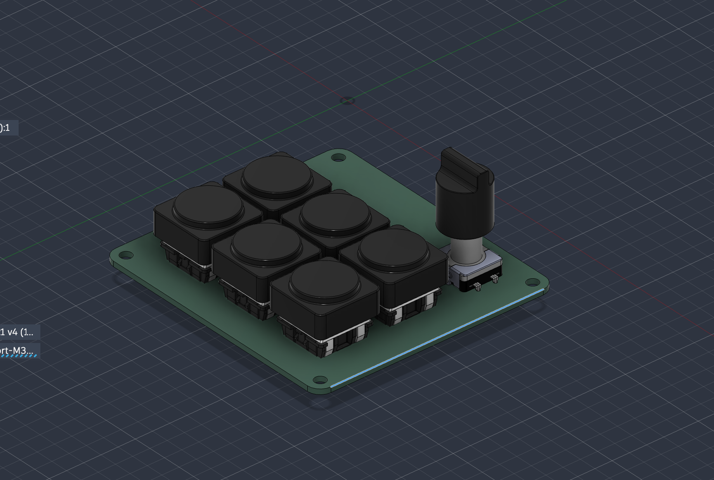
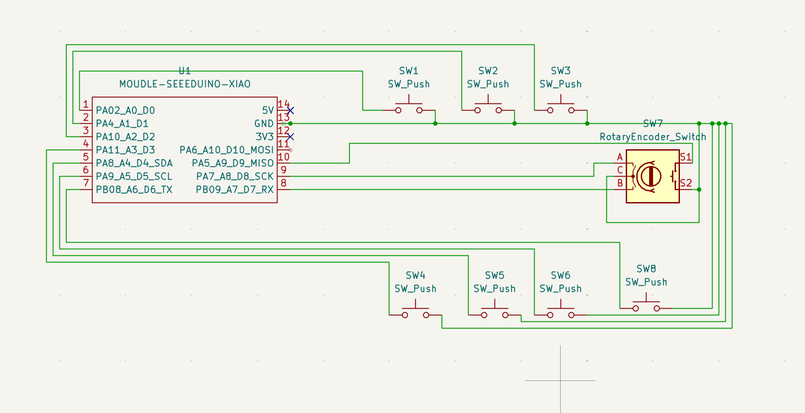
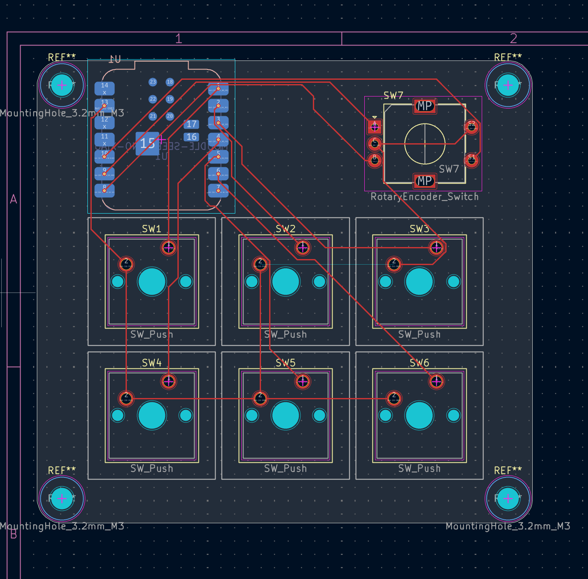
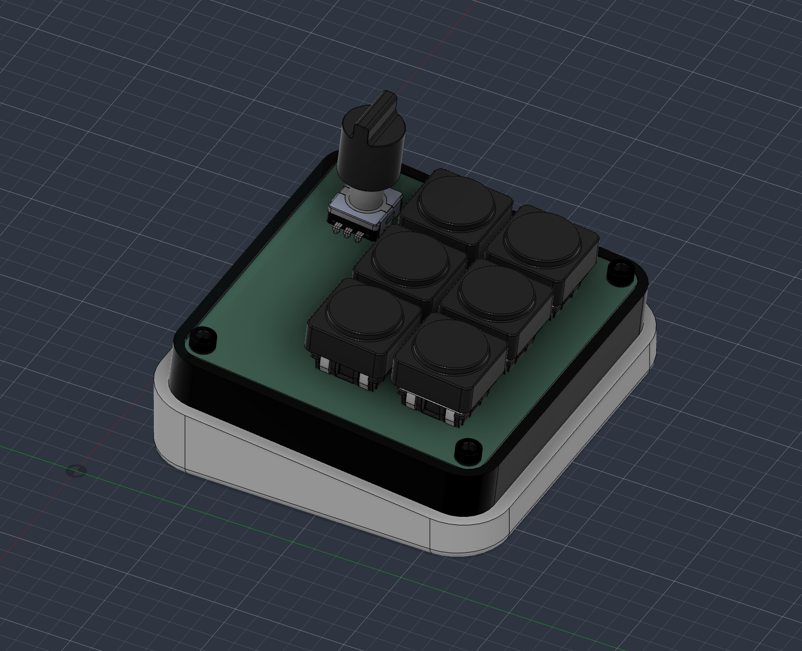

# Frostpad

My submission for Hack Club's Hackpad mission on Stardance. A 6-key macropad with a rotary encoder, built around a Seeed XIAO RP2040.

## What it does

Six keys mapped to the number row by default, plus a rotary encoder for volume up, volume down and mute. The keycaps and the encoder knob are both my own designs, modeled to fit standard MX switches and an EC11 encoder shaft.

## Schematic

The switches are wired directly to the XIAO, no diode matrix. I had enough GPIO pins for it (6 switches plus 3 pins for the encoder), so I kept it simple instead of adding a matrix I didn't need.

## PCB

Two layer board, 74mm by 69mm. Laid out the switches in a 3x2 grid with the encoder above them.

## Case

The case is two printed parts: a tray that holds the PCB and a tilted pedestal underneath it, so the board sits angled toward you instead of flat on the desk. No top plate, the switches sit exposed.

## Bill of materials

| Part | Qty | Notes |
|---|---|---|
| Seeed XIAO RP2040 | 1 | main MCU |
| MX-style mechanical switch | 6 | |
| EC11 rotary encoder w/ push switch | 1 | |
| Custom PCB | 1 | see `PCB/` |
| Printed tray | 1 | see `production/frostpad_tray.step` |
| Printed pedestal | 1 | see `production/frostpad_pedestal.step` |
| Printed keycap x6 | 6 | see `production/frostpadkeycap.step` |
| Printed encoder knob | 1 | see `production/frostpadvolumeknowb.step` |
| M3 screws | 4 | mounting holes |

## Firmware

Written in KMK, CircuitPython based. Lives in `Firmware/main.py`. Switches on D0 through D5, encoder A/B on D8/D7, encoder push on D9.

## Files

- `CAD/` - full assembled model
- `PCB/` - KiCad project, schematic, board
- `Firmware/` - main.py
- `production/` - gerbers, drill file, case and part STEP files for printing/fab
